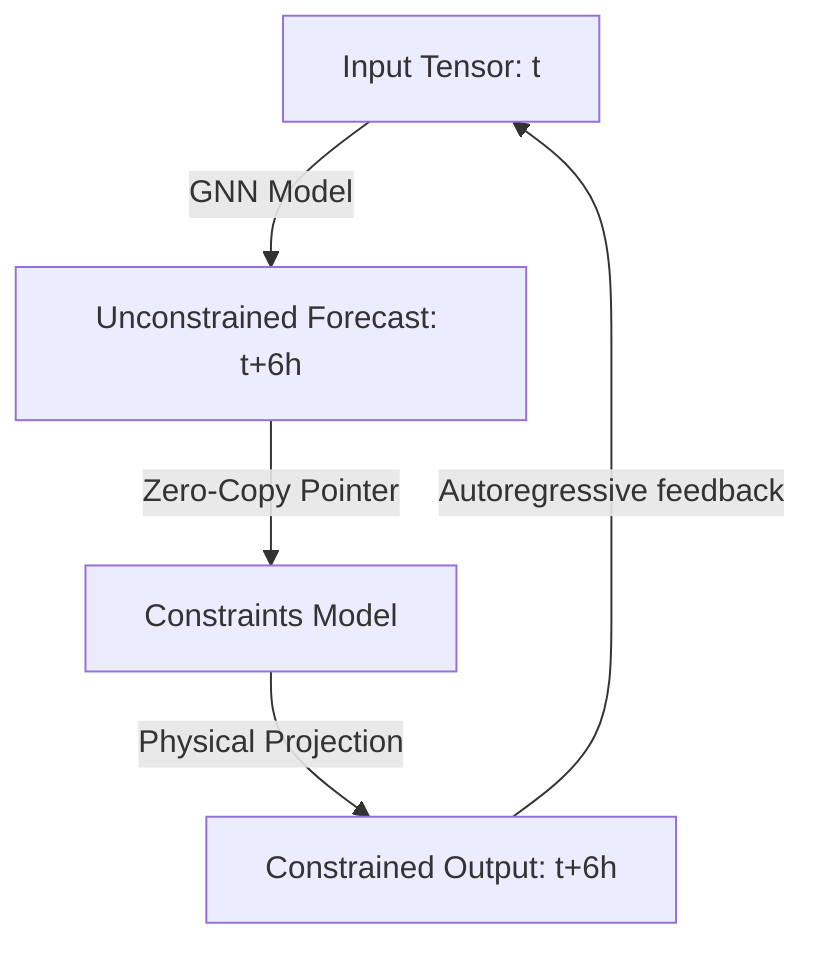

# Hard Constraints & Custom Graphs

Meteorological predictions must often satisfy physical conservation laws (e.g. mass conservation, water budget constraints, non-negativity of moisture fields) to remain stable during long rollouts. While standard GNNs are trained on data patterns, they do not inherently guarantee physical laws.

WeatherGraph supports appending a secondary **Physics Constraints Graph** directly inside the C++ execution pipeline. This guide explains how this mechanism works and how to configure it.

---

## 1. How C++ Physics Projection Works

In standard inference pipelines, enforcing physical constraints requires transferring the model's outputs back to Python, running NumPy/Xarray calculations, and copying the modified arrays back to the C++ engine. This introduces significant CPU/GPU memory copy overhead.

WeatherGraph avoids this by loading a second ONNX session dedicated to constraints. The C++ data plane runs the constraints model in-place immediately after the primary GNN:



During each forecast step:
1.  The primary GNN session runs and writes results to an intermediate tensor.
2.  If a `constraints_model_path` is configured, the C++ engine feeds this intermediate tensor directly as the input to the constraints session.
3.  The constraints graph executes (e.g. enforcing dry mass balance or projecting specific humidity to be $\ge 0$).
4.  The final output is returned and used as the feedback for the next step.

---

## 2. Configuration Example

To enable custom constraints, compile your physics projection equations into an ONNX graph and pass it to the constructor:

```python
import weathergraph as wg

model = wg.WeatherGraphModel(
    model_path="models/weather_gnn.onnx",
    weights_dir="data",
    constraints_model_path="models/physics_projection.onnx",
    execution_provider="cuda"  # Both models will load on CUDA
)
```

---

## 3. Creating a Physics Projection Graph

A constraints ONNX model must meet the following structural specifications:
*   **Input Shape**: `[1, nodes, 78]` (matching the primary GNN's output shape).
*   **Output Shape**: `[1, nodes, 78]` (matching the input shape).

You can build constraints models in PyTorch or TensorFlow, expressing the conservation equations as neural network layers with static weights.

### PyTorch Example
Below is an example of a PyTorch module that clips specific humidity to prevent negative values, and exports it to ONNX:

```python
import torch
import torch.nn as nn

class PhysicalClippingConstraints(nn.Module):
    def __init__(self, num_nodes=64800):
        super().__init__()
        self.num_nodes = num_nodes
        
        # Build a constant mask for specific humidity ('q') channels.
        # Specific humidity is variable index 1 on each of the 13 levels.
        self.q_mask = torch.zeros(78)
        for level_idx in range(13):
            q_channel = level_idx * 6 + 1
            self.q_mask[q_channel] = 1.0

    def forward(self, x):
        # x shape: [1, nodes, 78]
        # Clip all specific humidity values to be strictly non-negative (>= 0.0)
        q_clipped = torch.clamp(x, min=0.0)
        
        # Apply the mask: keep GNN values for non-q variables, use clipped values for q
        mask = self.q_mask.unsqueeze(0).unsqueeze(0)  # Shape: [1, 1, 78]
        output = torch.where(mask == 1.0, q_clipped, x)
        
        return output

# Export the constraints module to ONNX
model = PhysicalClippingConstraints()
dummy_input = torch.randn(1, 64800, 78)
torch.onnx.export(
    model,
    dummy_input,
    "models/physics_projection.onnx",
    input_names=["input_tensor"],
    output_names=["output_tensor"],
    dynamic_axes={"input_tensor": {1: "nodes"}, "output_tensor": {1: "nodes"}}
)
```

By placing physical guardrails inside the C++ ONNX execution loop, you ensure model stability during long rollouts without incurring data-copy overhead.