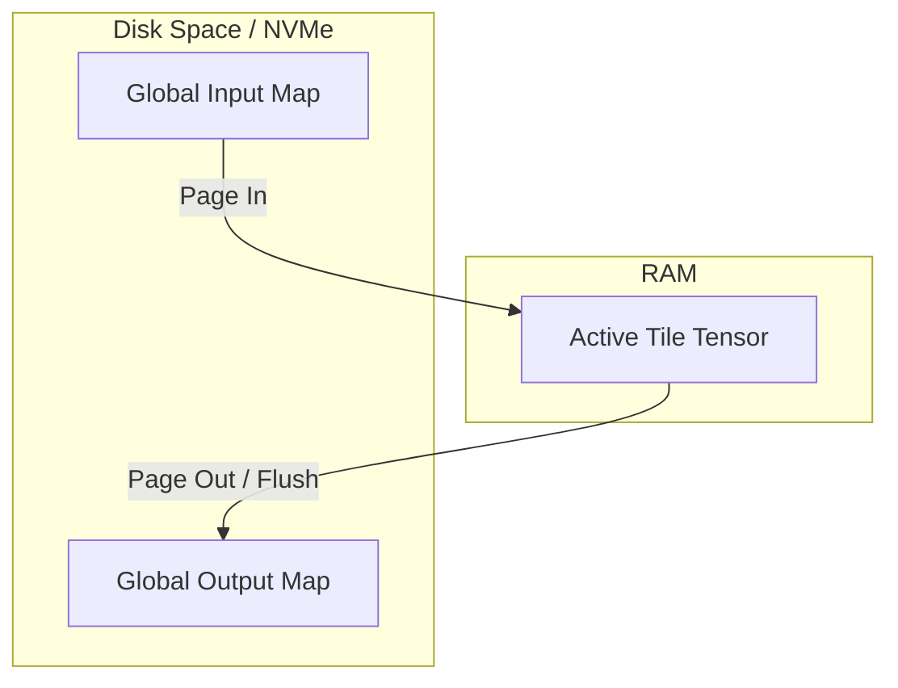

# Hardware Tuning & Memory Limits

Deploying deep learning weather prediction models at global scale requires careful management of host resources. A single high-resolution global graph can occupy several gigabytes of memory, and autoregressive rollouts multiply this requirement over time.

This guide explains how to configure WeatherGraph's low-memory flags, thread allocations, and memory mapping backends to run forecasts efficiently on resource-constrained systems.

---

## 1. Thread Pool Configuration

By default, ONNX Runtime allocates one thread per CPU core to execute parallel operators in the computation graph. While this maximizes throughput on single-tenant machines, it causes extreme CPU contention and virtual memory bloat on shared systems or high-core cloud VMs.

You can limit thread allocation using the `intra_op_threads` parameter:

```python
import weathergraph as wg

model = wg.WeatherGraphModel(
    model_path="models/weather_gnn.onnx",
    weights_dir="data",
    intra_op_threads=2  # Limit ONNX Runtime to 2 worker threads
)
```

### Recommendation Guidelines
*   **Workstations / Laptops**: Set `intra_op_threads` to `2` or `4`. This leaves enough CPU capacity for visualization, file writing, and operating system tasks.
*   **Shared HPC Nodes**: Set `intra_op_threads` to match the exact number of CPU slots allocated to your job script, preventing thread overscheduling.

---

## 2. Optimizing ONNX Runtime Allocations

ONNX Runtime includes aggressive memory management systems designed for peak GPU/CPU throughput. However, these systems can cause excessive memory reservations. WeatherGraph allows you to disable these optimizations to save RAM:

```python
model = wg.WeatherGraphModel(
    model_path="models/weather_gnn.onnx",
    weights_dir="data",
    disable_cpu_mem_arena=True,  # Disable CPU memory arena
    disable_mem_pattern=True     # Disable memory pattern reuse
)
```

### Disabling the CPU Memory Arena (`disable_cpu_mem_arena=True`)
*   **What it does**: Disables ONNX Runtime's custom memory arena allocator, forcing the engine to release memory back to the operating system immediately after an operator finishes execution.
*   **Trade-off**: Increases system call overhead (alloc/free calls), causing a minor slow-down in step throughput (typically 2–5%), but decreases the peak Resident Set Size (RSS) memory reservation by up to 40%.

### Disabling Memory Pattern Reuse (`disable_mem_pattern=True`)
*   **What it does**: Prevents ONNX Runtime from analyzing operator execution history to pre-allocate and cache static memory execution paths for future steps.
*   **Trade-off**: Decreases peak memory usage during initial steps, making it ideal for systems running mixed rollouts where input shapes vary between steps.

---

## 3. Offloading Memory via Memory Mapping (`memmap`)

When using [Spatial Tiling](spatial-tiling.md) to split a global grid into smaller overlapping partitions, the global state tensors must be maintained to coordinate boundaries between steps. At high resolutions, keeping these state tensors in RAM can trigger Out-Of-Memory (OOM) faults.

WeatherGraph provides a memory-mapped backend that offloads state arrays to disk:

```python
model = wg.WeatherGraphModel(
    model_path="models/weather_gnn.onnx",
    weights_dir="data",
    spatial_tiling=True,
    tile_bundle_path="tile_bundle/manifest.json",
    tile_state_backend="memmap",          # Offload states to disk
    tile_state_dir="/mnt/fast_nvme/tmp"   # Use a fast local directory
)
```

### How Memory Mapping Works
When `tile_state_backend="memmap"` is active, the global input, output, and halo-stitching weight buffers are allocated on disk as binary files using NumPy's `memmap` (leveraging the virtual memory page cache of the operating system):



The operating system handles swapping memory pages in and out of RAM automatically. To maximize throughput, the `tile_state_dir` should point to a fast local SSD or NVMe drive rather than a network-mounted disk (NFS).