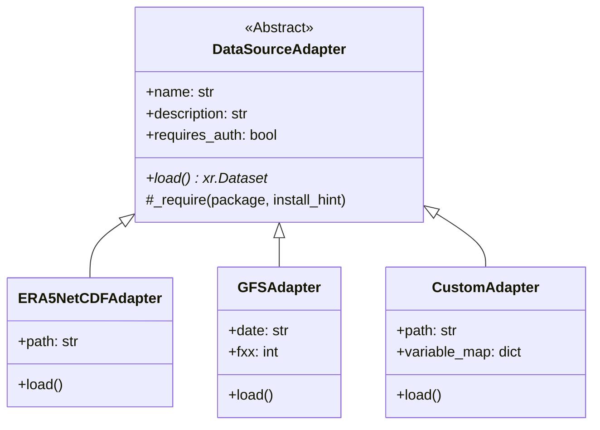

# Data Ingestion & Adapters Architecture

The WeatherGraph ingestion layer decouples the core prediction engine from the diverse storage formats and APIs used by global meteorological services. This guide explains how the pluggable adapter framework is structured and how to extend it.

---

## 1. The Adapter Framework

All data adapters inherit from the abstract base class `DataSourceAdapter` defined in `weathergraph/data_sources.py`. Each adapter implements a single public method: `.load()`.



### The Ingestion Registry
Adapters are registered in the global `REGISTRY` dictionary inside `weathergraph/data_sources.py`. When a user requests a source via the factory function:

```python
from weathergraph.data_sources import load_source
adapter = load_source("gfs", date="2026-06-01")
```
The factory instantiates the corresponding registered class, forwarding any keyword arguments to its constructor.

---

## 2. In-Depth: Built-in Adapters

### `era5_netcdf` (ERA5 Local NetCDF)
Loads local files compiled from Copernicus CDS archives. It reads data lazily and does not perform remote HTTP requests.
*   **Requirements**: None (uses standard Python netCDF4/xarray).

### `ecmwf_open` (ECMWF Open Data)
Fetches the latest forecast runs (updated twice daily) from ECMWF's public HTTPS data portal.
*   **Requirements**: `pip install ecmwf-opendata cfgrib eccodes`
*   **Mechanism**: Uses the `ecmwf-opendata` client to download GRIB2 slices, then parses them via the `cfgrib` engine.

### `cds_era5` (Copernicus CDS ERA5 Reanalysis)
Accesses the archive of hourly global climate reanalysis variables.
*   **Requirements**: `pip install cdsapi`
*   **Mechanism**: Issues web requests to Copernicus CDS servers. It requires an API Key set in `~/.cdsapirc` or through the `CDSAPI_KEY` environment variable.

### `gfs` (NOAA GFS on AWS S3)
Retrieves the Global Forecast System model runs hosted on public AWS cloud buckets.
*   **Requirements**: `pip install herbie-data`
*   **Mechanism**: Uses `Herbie` to retrieve individual GRIB2 slices, extracts vertical pressure levels, and automatically converts geopotential heights ($m$) to geopotential ($m^2/s^2$) via standard gravity multiplication ($g = 9.80665$).

### `open_meteo` (Open-Meteo API)
Queries point-location forecasts from Open-Meteo's public HTTPS endpoint.
*   **Requirements**: None (uses standard library `urllib` and `json`).
*   **Note**: Useful for single-coordinate column models, not global maps.

### `zarr` (Local & Cloud Zarr Stores)
Reads chunked, compressed multidimensional arrays.
*   **Requirements**: `pip install 'weathergraph[cloud]'` (for GCS/S3 support).
*   **Mechanism**: Integrates with `gcsfs`, `s3fs`, or `adlfs` to stream slices directly from bucket endpoints.

### `custom` (Schema-Driven Mapping)
Maps non-conforming local files (NetCDF, GRIB2, Zarr) to the expected model variables. It performs dimension renaming, variable translation, vertical unit conversion (e.g. Pa to hPa), and scaling.

---

## 3. Writing a Custom Adapter

To integrate a new weather data source (for example, a local simulation model or regional meteorological server), write a subclass of `DataSourceAdapter` and register it.

### Example Implementation
Here is how to write and register a custom adapter for a simulated forecast system:

```python
import xarray as xr
from weathergraph.data_sources import DataSourceAdapter, REGISTRY

class MySimulationAdapter(DataSourceAdapter):
    name = "my_simulation"
    description = "Load localized simulated atmospheric forecasts"
    requires_auth = False

    def __init__(self, run_directory: str, timestep_hours: int = 6):
        self.run_directory = run_directory
        self.timestep_hours = timestep_hours

    def load(self) -> xr.Dataset:
        # Load the raw simulation files
        ds = xr.open_mfdataset(f"{self.run_directory}/*.nc")
        
        # 1. Rename dimensions to match model requirements
        ds = ds.rename({"lat": "latitude", "lon": "longitude", "press": "level"})
        
        # 2. Normalize geopotential height (if in meters) to geopotential
        if "height" in ds:
            ds["z"] = ds["height"] * 9.80665
            
        # 3. Ensure the vertical level coordinates are in hPa
        if ds["level"].attrs.get("units") == "Pa":
            ds = ds.assign_coords(level=ds.level / 100.0)
            
        return ds

# Register the custom adapter in the global registry
REGISTRY["my_simulation"] = MySimulationAdapter
```

After registration, your custom source can be loaded dynamically like any built-in adapter:

```python
from weathergraph.data_sources import load_source

my_source = load_source("my_simulation", run_directory="data/sims/run_a")
dataset = my_source.load()
```
This pluggable architecture ensures that WeatherGraph remains extensible and compatible with any forecast repository.