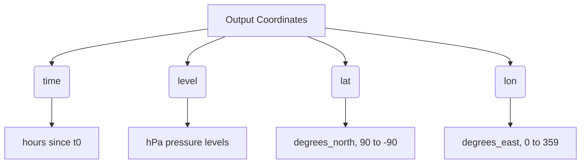

# Output Formats & Exporting

WeatherGraph is designed to output predictions directly into industry-standard, self-describing scientific file formats. This page details the formatting choices, file layouts, and metadata injection schemas used during forecast exports.

---

## 1. Format Comparison

| Format | Storage Style | Streaming? | Primary Use Case |
| :--- | :--- | :--- | :--- |
| **`netcdf4`** | Directory containing one classic NetCDF file per variable-level combination | **Yes** (step-by-step) | Local analysis, legacy system integrations, workstation post-processing |
| **`zarr`** | Directory containing one Zarr store per variable-level combination | **Yes** (step-by-step) | Cloud-native workflows, lazy loading via Dask, big-data analytics |
| **`npz`** | Single zipped archive containing flat raw numpy arrays | **No** (buffers in RAM) | Machine learning pipeline ingestion, model-to-model transfer |

---

## 2. Directory Layouts (NetCDF & Zarr)

When exporting using `netcdf4` or `zarr` formats, the engine creates a directory at your specified output path. To optimize file size and access patterns, the dataset is split by variable and pressure level:

```text
my_forecast/
  ├── z_50hPa.nc
  ├── z_100hPa.nc
  ├── ...
  ├── t_50hPa.nc
  ├── t_100hPa.nc
  └── ...
```

Each of these files is a complete, self-contained dataset containing the 3D fields (`time`, `lat`, `lon`) for that specific atmospheric level.

---

## 3. CF-1.11 Metadata Conventions

Meteorological datasets require descriptive metadata to guarantee scientific interoperability. WeatherGraph automatically injects Climate and Forecast (CF) metadata conventions into exported NetCDF4 files and Zarr stores via `weathergraph.cf_meta.py`.

### Global Attributes
Every file contains the following global attributes:
*   `Conventions`: `"CF-1.11"`
*   `source`: `"WeatherGraph Neural Weather Prediction Engine"`
*   `WeatherGraph`: `"forecast"`
*   `steps`: Total number of autoregressive steps run.
*   `level_hPa`: The pressure level of the file (e.g. `850`).

### Variable-Specific Attributes
WeatherGraph maps output variables to their official CF standard names and SI physical units:

| Variable | Long Name | Standard Name | Units |
| :--- | :--- | :--- | :--- |
| **`z`** | Geopotential | `geopotential` | $m^2 / s^2$ |
| **`q`** | Specific Humidity | `specific_humidity` | $kg / kg$ |
| **`t`** | Air Temperature | `air_temperature` | $K$ |
| **`u`** | Eastward Wind Component | `eastward_wind` | $m / s$ |
| **`v`** | Northward Wind Component | `northward_wind` | $m / s$ |
| **`w`** | Vertical Velocity (Pressure) | `lagrangian_tendency_of_air_pressure` | $Pa / s$ |

---

## 4. Coordinate Dimension Specifications

The output coordinates are dynamically constructed using the model's reference grid geometry and initialization time:



### Time Axis
The time coordinate is calculated relative to the start time ($t_0$) using a 6-hour interval:
*   `units`: `"hours since YYYY-MM-DD HH:MM:SS"`
*   `calendar`: `"proleptic_gregorian"`
*   `standard_name`: `"time"`

### Latitude Axis
*   `units`: `"degrees_north"`
*   `standard_name`: `"latitude"`
*   `axis`: `"Y"`
*   Values are linearly spaced from $90.0^\circ$ (North Pole) to $-90.0^\circ$ (South Pole).

### Longitude Axis
*   `units`: `"degrees_east"`
*   `standard_name`: `"longitude"`
*   `axis`: `"X"`
*   Values are linearly spaced from $0.0^\circ$ to $360.0^\circ - \Delta\text{lon}$ (e.g. $359.0^\circ$ on a $1^\circ$ grid).