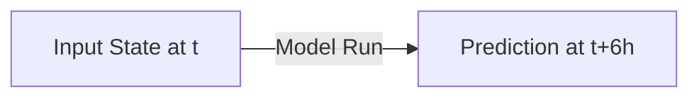
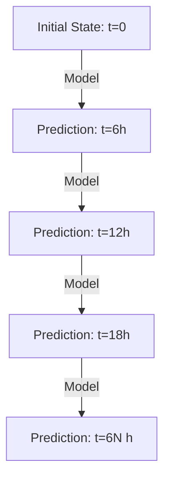
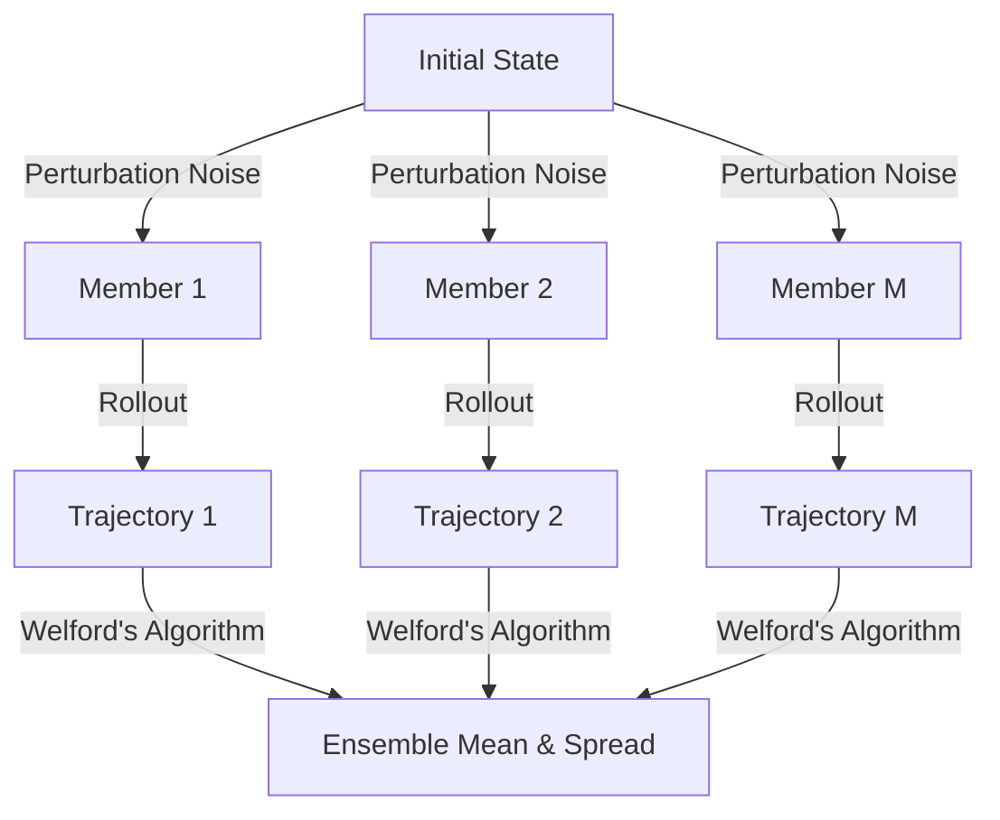

# Inference Modes

WeatherGraph supports four distinct execution modes to accommodate different scientific, operational, and hardware constraints. This page explains their designs, use cases, and performance profiles.

---

## 1. Single-Step Prediction

The single-step prediction mode runs the model for a single 6-hour forecast interval.

*   **API Method**: `model.predict_one_step(ds)`
*   **CLI Option**: `weathergraph forecast --steps 1 --output-format none`

### Use Cases
*   **Evaluation & Validation**: Comparing short-range prediction error metrics directly against observations.
*   **Data Assimilation**: Serving as the background forecast step inside physical data assimilation systems.

---

## 2. Autoregressive Rollout

The standard autoregressive mode runs a multi-step rollout forecast. The output of each step is fed back into the engine as the input for the subsequent step.

*   **API Methods**:
    *   `model.forecast(initial_ds, steps, as_dataset=True)`: Runs the loop and returns a fully materialized `xarray.Dataset`.
    *   `model.iter_forecast(initial_ds, steps)`: A Python generator that yields the output tensor of each step as soon as it is computed.
*   **CLI Option**: `weathergraph forecast --steps N --output-format none` (runs iteratively).

### In-Memory vs. Iterative
*   `forecast(as_dataset=True)` is the easiest option for analysis because it returns a single coordinate-aligned dataset. However, because it stores the entire trajectory in RAM, it is susceptible to Out-Of-Memory (OOM) errors on large grids.
*   `iter_forecast()` is a generator. It yields the current step's tensor and frees up the previous step's memory, keeping RAM usage flat regardless of the forecast horizon length.

---

## 3. Streaming Disk Export

This mode runs a multi-step autoregressive rollout but streams output slices directly to storage, completely avoiding the memory overhead of holding a forecast trajectory in RAM.

*   **API Method**: `model.forecast_export(initial_ds, steps, output_path, fmt, t0)`
*   **CLI Option**: `weathergraph forecast --steps N --output-format [netcdf4|zarr|npz] --output-path ...`

### Supported Formats
*   **`netcdf4`** (Streaming): Writes step slices immediately to a directory containing one NetCDF file per variable-level combination. Recommended for standard workstation filesystems.
*   **`zarr`** (Streaming): Appends step slices to chunked Zarr stores, ideal for cloud storage buckets (AWS S3, Google Cloud Storage).
*   **`npz`** (Buffered): Exports raw un-reshaped numpy arrays. This format does **not** support streaming; it materializes the entire forecast run in memory before writing to disk due to the structural limitations of ZIP archives.

---

## 4. Probabilistic Ensemble Inference

Instead of a single deterministic forecast, this mode runs multiple perturbed trajectories and aggregates the statistics in real-time.

*   **API Method**: `model.predict_ensemble(...)`
*   **CLI Option**: `weathergraph ensemble ...`

### Noise Injection
The engine injects additive Gaussian noise to the dynamic fields (all variables except geopotential `z`) at the start of each autoregressive step. This simulates atmospheric chaos and forecast model uncertainty.

### Real-time Statistics ($O(1)$ Memory)
Running a 50-member, 40-step forecast at high resolution would require hundreds of gigabytes of RAM. WeatherGraph solves this by utilizing **Welford's Algorithm for Covariance**. 

As each ensemble member finishes its rollout, the C++ layer updates the cumulative mean and squared difference accumulator in-place. Once the run finishes, the engine outputs the exact mean and standard deviation (spread), meaning the memory footprint is constant and depends only on the grid shape—not the number of ensemble members.

### Rule-Based Threshold Probabilities
You can specify named threshold rules (e.g. frost risk where temperature drops below $273.15\text{ K}$). The engine records the percentage of ensemble members that exceed the threshold at each step, outputting a spatial probability map between `0.0` (no members) and `1.0` (all members).