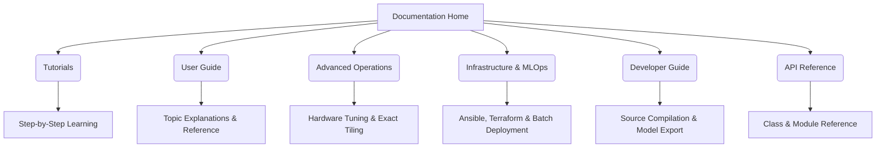

# Welcome to WeatherGraph

WeatherGraph is an open-source, high-performance global weather prediction engine driven by Graph Neural Networks (GNNs). It is designed to run research-grade and operational global weather forecasts on standard hardware, bridging the gap between cutting-edge artificial intelligence and the daily workflows of meteorologists, climatologists, and scientific researchers.

WeatherGraph combines a lightning-fast C++ inference core wrapped around ONNX Runtime with a flexible, scientific Python API built on top of `xarray`, `dask`, and `pandas`. This unique structure delivers the best of both worlds: zero-copy computational efficiency in the data plane and rich, domain-friendly orchestration in the control plane.

---

## Core Philosophy

Our design is guided by four primary principles:

1. **Accessibility**: Weather forecasting shouldn't require an entire supercomputer center. WeatherGraph runs global forecasts at target resolutions up to 0.1° on commercial GPUs or standard CPU workstations.
2. **Scientific Rigor**: Predictions must adhere to standard meteorological practices. WeatherGraph enforces compliance with CF-1.11 metadata conventions, uses physical units, and integrates seamlessly with the Python climate ecosystem (`MetPy`, `xCDAT`, and `xarray`).
3. **Hardware Efficiency**: We minimize computational overhead through zero-copy buffer sharing between Python and C++, memory arena configurations, and custom graph tuning.
4. **Modularity**: Every part of the pipeline—from data retrieval (ECMWF, NOAA GFS, Copernicus CDS) to autoregressive rollouts and tiling—is pluggable and fully customizable.

---

## Technical Highlights

- **Zero-Copy Inference Boundary**: Data passes directly from Python `numpy`/`xarray` structures into the C++ ONNX core via pybind11 buffer protocols, completely avoiding memory copy overhead during step rollouts.
- **Exact Spatial Tiling**: Run global 0.1° target forecasts on hardware with limited VRAM. By utilizing exact tile bundles and mathematical overlap calculations, WeatherGraph divides massive global graphs into manageable chunks without introducing boundary approximations.
- **O(1) Memory Ensembles**: Generate probabilistic forecasts using noise injection and aggregate them in real-time using Welford's algorithm for running variance and mean. Memory usage remains constant whether running 10 or 1,000 ensemble members.
- **Streaming Output Pipelines**: Autoregressive rollouts can stream predictions directly to NetCDF4 or Zarr stores on a step-by-step basis, avoiding the memory bloat of keeping entire multi-day forecasts in RAM.

---

## Documentation Structure

This documentation is structured following the **Diátaxis framework**, dividing information by user intent:

*   **[Introduction & Setup](index.md)**: Installs the framework and guides you through your first CLI and Python runs.
*   **[Tutorials](tutorials/first-forecast.md)**: Hands-on, step-by-step lessons for first forecasts, custom data adapters, visualization, and exports.
*   **[User Guide](guide/engine-architecture.md)**: In-depth explanations of the system architecture, inference modes, and integration with the wider climate ecosystem.
*   **[Advanced Operations](advanced/hardware-tuning.md)**: Guides for low-memory environments, execution providers (CUDA/TensorRT), tiling grids, probabilistic ensembles, and physical hard constraints.
*   **[Infrastructure & MLOps](ops/ansible.md)**: Production deployment templates using Ansible, Terraform, Cloud Batch jobs, and CI/CD pipelines.
*   **[Developer & Contributor Guide](dev/building.md)**: Information on building from source, model conversion, generating custom tile bundles, and running validation suites.
*   **[API Reference](api/model.md)**: The programmatic reference for `weathergraph.model`, `weathergraph.data_sources`, integrations, and C++ bindings.