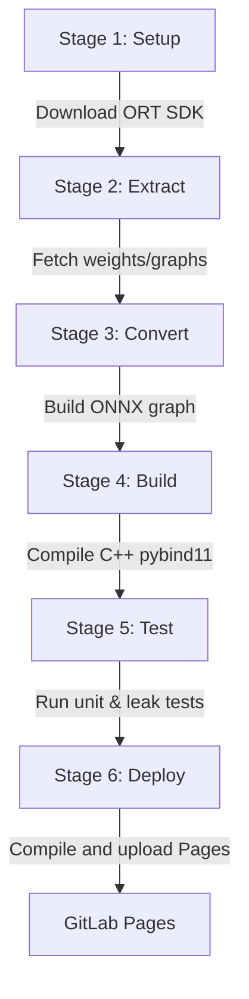

# CI/CD Validation & Pages Deployment

To guarantee code reliability and maintain up-to-date documentation, WeatherGraph uses automated CI/CD pipelines. This guide describes the GitLab CI/CD pipeline stages defined in `.gitlab-ci.yml` and how to replicate them in GitHub Actions.

---

## 1. GitLab CI/CD Pipeline Stages

The `.gitlab-ci.yml` pipeline is divided into six stages to ensure that dependency fetching, graph generation, compilation, unit testing, and deployment are executed in a structured sequence:



### Stage 1: Setup (`setup:onnxruntime`)
*   **Role**: Downloads the ONNX Runtime dynamic libraries (`libonnxruntime.so.1.18.0`) for target architectures.
*   **Artifacts**: Saves compiled binaries to `onnxruntime-sdk/lib/` for use in compilation stages.

### Stage 2: Extract (`extract:artifacts`)
*   **Role**: Downloads base physics parameters, normalization arrays, and spatial coordinates from remote caches (S3/GCS) via the `WEATHERGRAPH_DATA_CACHE_URL` environment variable.
*   **Trigger**: Only runs on the `model-update` branch or when triggered manually via the GitLab UI.

### Stage 3: Convert (`convert:onnx`)
*   **Role**: Invokes the python converter scripts (`make convert`) to generate the optimized GNN ONNX graph file `models/weather_gnn.onnx` from the raw data files.

### Stage 4: Build (`build:cpp`)
*   **Role**: Compiles the C++ source files using CMake and `scikit-build-core`, writing the binary shared objects into `weathergraph/core/`.

### Stage 5: Test (`test:suite`)
*   **Role**: Executes the test suite (`pytest`) covering Python accessors, C++ option bindings, and memory leaks.

---

## 2. The Documentation Deploy Job (`pages`)

The `pages` job builds the documentation site and deploys it to GitLab Pages:

```yaml
pages:
  stage: deploy
  script:
    - pip install mkdocs-material "mkdocstrings[python]" pymdown-extensions --quiet
    - pip install -e . --quiet  # Compile package to allow docstring parsing
    - mkdir -p public
    - cp -r docs/* public/       # Copy index.html landing page to public root
    - mkdocs build -d public/guide # Compile MkDocs markdown into public/guide/
  artifacts:
    paths:
      - public
  rules:
    - if: '$CI_COMMIT_BRANCH == $CI_DEFAULT_BRANCH'
```

### Deployment Layout
The landing page and the markdown documentation are compiled together:
*   **URL Root (`/`)**: Serves the high-performance, dark-mode landing page (`docs/index.html`).
*   **URL Path (`/guide/`)**: Serves the search-enabled MkDocs Material site compiled from `docs_src/`.

---

## 3. GitHub Actions Replicas

For repositories hosted on GitHub, you can configure an identical pipeline using GitHub Actions. Save the workflow below as `.github/workflows/validate.yml`:

```yaml
name: Validate & Deploy Pages

on:
  push:
    branches: [ main ]
  pull_request:
    branches: [ main ]

jobs:
  validate:
    runs-on: ubuntu-latest
    steps:
      - name: Checkout Repository
        uses: actions/checkout@v3

      - name: Set up Python
        uses: actions/setup-python@v4
        with:
          python-size: '3.11'
          cache: 'pip'

      - name: Install Build Dependencies
        run: |
          sudo apt-get update
          sudo apt-get install -y cmake patchelf build-essential

      - name: Compile and Install Package
        run: |
          pip install --upgrade pip
          pip install pybind11 scikit-build-core
          pip install -e .[test,docs]

      - name: Run Pytest Suite
        run: |
          PYTHONPATH=. pytest

      - name: Compile Documentation
        if: github.ref == 'refs/heads/main'
        run: |
          mkdir -p public
          cp -r docs/* public/
          mkdocs build -d public/guide

      - name: Upload Pages Artifacts
        if: github.ref == 'refs/heads/main'
        uses: actions/upload-pages-artifact@v1
        with:
          path: 'public'

  deploy-pages:
    needs: validate
    if: github.ref == 'refs/heads/main'
    runs-on: ubuntu-latest
    permissions:
      pages: write
      id-token: write
    environment:
      name: github-pages
      url: ${{ steps.deployment.outputs.page_url }}
    steps:
      - name: Deploy to GitHub Pages
        id: deployment
        uses: actions/deploy-pages@v2
```
This configuration executes the same build validations on pull requests and deploys the unified landing page and guide to GitHub Pages on every merge to `main`.