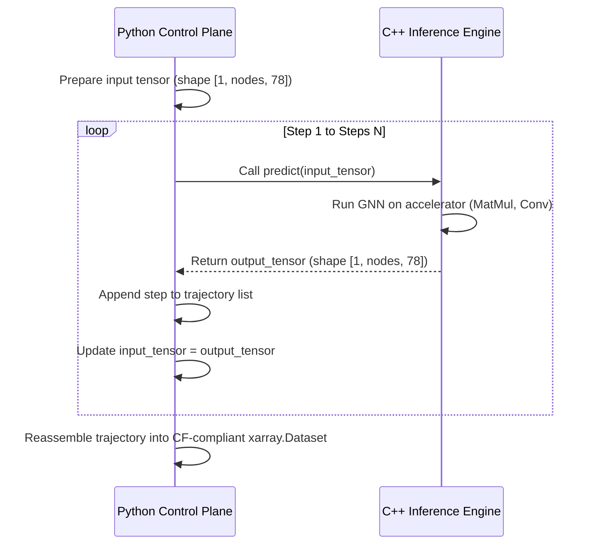

# Your First Forecast

This tutorial provides a step-by-step walkthrough to run your very first global weather forecast using WeatherGraph. You will set up your environment, prepare initial conditions, instantiate the GNN engine, execute a 48-hour forecast rollout, and inspect the resulting output dataset.

---

## Prerequisites

Before starting, ensure you have:
1. Followed the [Installation Guide](../intro/install.md) to install WeatherGraph.
2. Downloaded the model weights and graph definitions:
   ```bash
   weathergraph download-model \
     --model-url https://assets.wanderspool.org/models/weathergraph_weights.pkl \
     --output-filename model.pkl
   
   weathergraph compile-model \
     --weights-file ~/.cache/weathergraph/model.pkl \
     --output-file models/weather_gnn.onnx
   ```
3. Verified you have the sample ERA5 initial conditions file in `data/era5_archives/init.nc`.

---

## Step 1: Initialize the Input Data Adapter

WeatherGraph requires a normalized, 78-channel input state to begin inference. Rather than manually fetching and reshaping NetCDF variables, we use WeatherGraph's `load_source()` factory to instantiate an ERA5 file adapter:

```python
import weathergraph as wg

# Create the data adapter pointing to our initial state NetCDF
adapter = wg.load_source("era5_netcdf", path="data/era5_archives/init.nc")

# Load and parse the dataset
initial_state = adapter.load()
```

When you call `adapter.load()`, the adapter:
*   Opens the NetCDF file lazily (using `xarray` and `netCDF4`).
*   Verifies the presence of the six core variables: geopotential (`z`), specific humidity (`q`), temperature (`t`), $u$-wind (`u`), $v$-wind (`v`), and vertical velocity (`w`).
*   Ensures that these variables are defined across the 13 required pressure levels (50 to 1000 hPa).
*   Corrects coordinates (e.g. converting Pa to hPa for the vertical axis, or scaling geopotential height to geopotential).

---

## Step 2: Load the WeatherGraph Model

Next, instantiate the `WeatherGraphModel` wrapper. This loads the ONNX computation graph and links it with the high-performance C++ backend:

```python
model = wg.WeatherGraphModel(
    model_path="models/weather_gnn.onnx",
    weights_dir="data",
    execution_provider="cpu"  # Change to "cuda" if compiling with GPU support
)
```

During initialization, the engine:
1. Spawns an internal ONNX Runtime session in the C++ layer.
2. Detects the node count and topology of the graph.
3. Loads the global normalization constants (`means.npy` and `stds.npy`) from the `data` directory.

---

## Step 3: Run the Autoregressive Rollout

We will run a 48-hour forecast. Since each autoregressive step spans a 6-hour interval, we need 8 steps ($8 \times 6 = 48$ hours):

```python
# Execute the rollout
forecast_dataset = model.forecast(
    initial_state,
    steps=8,
    as_dataset=True
)
```

### What happens under the hood?
WeatherGraph runs an autoregressive loop. Because the C++ ONNX model is trained to predict the state at $t+6\text{h}$ given the state at $t$, the Python control plane orchestrates the loop:



---

## Step 4: Inspect the Forecast Output

Once completed, `forecast_dataset` is returned as a fully materialized, CF-compliant `xarray.Dataset`. Let's inspect its structure:

```python
# Print coordinates and dimensions
print(forecast_dataset.coords)
```

You should see a coordinate system matching the global reference grid:
*   `time`: 8 forecast time steps, starting from the time of your initial conditions with a 6-hour spacing.
*   `level`: 13 vertical levels (50, 100, 150, 200, 250, 300, 400, 500, 600, 700, 850, 925, 1000 hPa).
*   `lat`: Latitude grid (90.0 to -90.0).
*   `lon`: Longitude grid (0.0 to 359.0).

### Access and Analyze Variables
You can select variables and slice them as needed using standard Xarray selection:

```python
# Get temperature at 850 hPa at the 24-hour mark (step index 4)
temp_24h_850 = forecast_dataset["t"].sel(level=850, time=forecast_dataset.time[4])

# Convert geopotential back to geopotential height (gpm) for display
gpm_500 = forecast_dataset["z"].sel(level=500) / 9.80665
```

---

## Step 5: Save the Forecast to Disk

Finally, write the resulting forecast dataset to a local NetCDF file so it can be used for downstream analysis or visualization:

```python
forecast_dataset.to_netcdf("output/first_forecast.nc")
print("Forecast successfully generated and saved to output/first_forecast.nc!")
```
Congratulations! You have successfully configured and executed your first neural weather forecast with WeatherGraph.